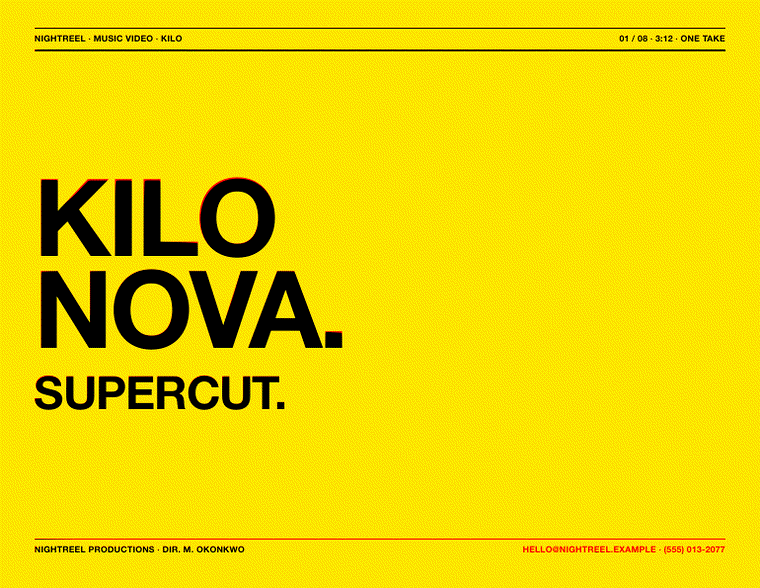
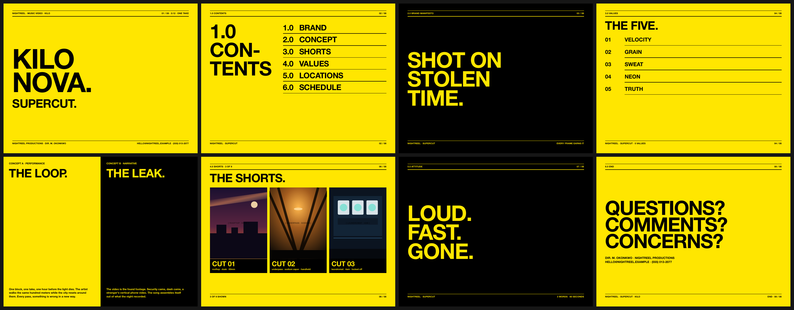
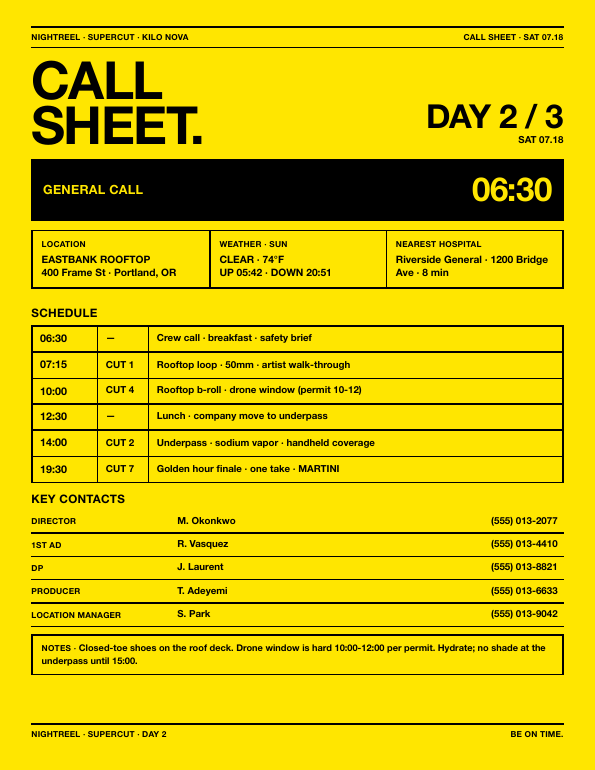
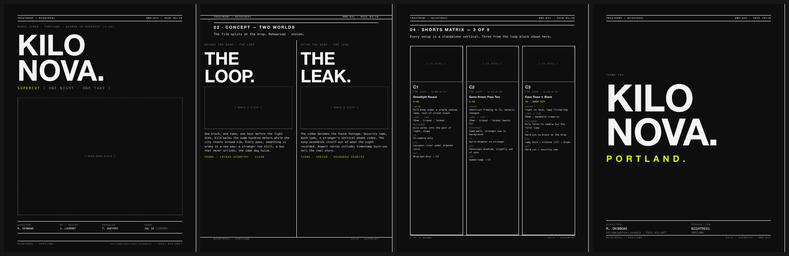
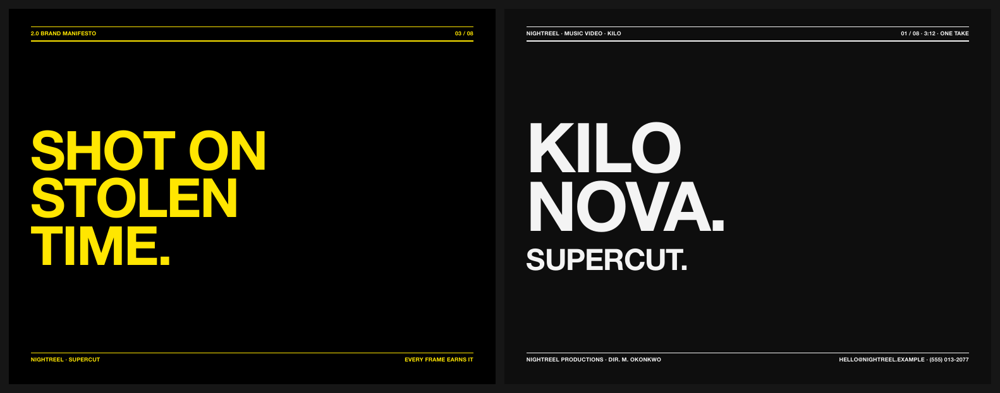

# CALLSHEET

**PRODUCTION PAPERWORK FROM ONE JSON FILE. THE DECK, THE DAY, THE DETAILS.**

[](LICENSE)
[](callsheet.mjs)



---

## 01 / THE PITCH

Every video shoot runs on documents: the treatment that sells it, the call
sheet that runs the day. Most of them get built at 2am in software that
fights back. callsheet renders them from flat JSON files, in a design
language loud enough to survive a producer's inbox: flood color, 900-weight
caps, ink-fill pages. Fill in the tokens, send the PDF, go scout.

## 02 / THE DOCUMENTS

**The treatment.** Eight landscape pages: cover, contents, manifesto, values,
concept split, shorts board with reference frames, attitude, end card.



**The call sheet.** One portrait page that runs the shoot day: general call
band, location, weather and sun, nearest hospital, the schedule with cut
numbers, key contacts, notes. Bottom bar says BE ON TIME because it means it.



**The monodark treatment.** The heavyweight: ten portrait pages on a 12-column
modular grid. Thesis and deliverables table, a two-worlds concept split, a
beat spine cut to the song, a shorts matrix with full shot recipes, grammar,
locations, palette swatches, and the schedule. Drop images named `hero.jpg`,
`s1.jpg`, `loc1.jpg`... into `refs/` and the plates fill themselves.



## 03 / RUN IT

```bash
git clone https://github.com/vcspr/callsheet && cd callsheet
npm install && npx playwright install chromium

node callsheet.mjs example/treatment.json                           # the drench deck
node callsheet.mjs example/day.json --skin callsheet                # the day
node callsheet.mjs example/treatment-monodark.json --skin monodark  # the heavyweight
```

Copy an example JSON, replace the fiction with your production, drop
reference frames in a `refs/` folder next to it. Every value is a flat
string. No nesting, no schema to learn.

## 04 / THE SYSTEM

Skins are single HTML files with `{{TOKENS}}`. The renderer fills every token
from your JSON, copies `refs/` beside the output, and prints through headless
Chromium so the PDF is exactly what the CSS says. Tokens you skip are warned
about and blanked, never invented.

`PAPER_HEX`, `INK_HEX`, and `ACCENT_HEX` drive the entire palette of any
skin. Same JSON, two hex codes apart:



## 05 / MAKE IT YOURS

Skins live in `skins/` as plain HTML. Copy one, change the bones, pass
`--skin yours`. The example refs are hand-built SVG frames, so the repo ships
zero photography and clones with nothing to license.

## 06 / END CARD

On the slate: editorial and cinematic treatment skins, shot-list and storyboard skins, a one-line schedule, budget
top-sheets, and a 16:9 screener variant.

[MIT](LICENSE) © 2026 Victor Uwakwe

**QUESTIONS? COMMENTS? CONCERNS?**
